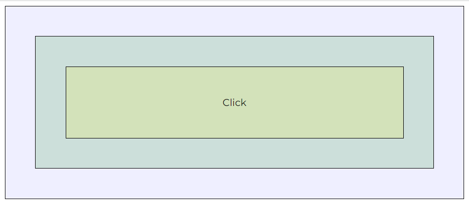

### What is bubble & capture?

In JavaScript, bubbling and capturing are two phases of event processing that determine the order in which elements receive an event.

#### Example

**3 HTML divs** one inside another.

```html
<div id="level-1">
  <div id="level-2">
    <div id="level-3">
      Click
    </div>
  </div>
</div>
```

**UI presentation** of the divs.



JavaScript **events** on each divs with default `bubbling` enabled.

```js
document.addEventListener('DOMContentLoaded', ready);

function ready() {
  const level1 = document.querySelector('#level-1');
  const level2 = document.querySelector('#level-2');
  const level3 = document.querySelector('#level-3');

  level1.addEventListener('click', click);
  level2.addEventListener('click', click);
  level3.addEventListener('click', click);
}

function click(e) {
  console.log('@event', e.target);
}
```

As a result **3 events get triggered** on different scenarios.

```log
1. click on the inner most div (id="level-3")
Result: Triggers 3 events. In inside-out order. level-3 -> level-2 -> level-1

2. click on the 2nd inner div (id="level-2")
Result: Triggers 2 events. In inside-out order. level-2 -> level-1

3. click on the outer most div (id="level-1")
Result: Triggers only 1 event. That is for level-1
```

**Let's** enable `capturing`. Which is opposite of `bubbling` in terms of the **order of events** to be triggered.

```js
level1.addEventListener('click', click, true);
level2.addEventListener('click', click, true);
level3.addEventListener('click', click, true);
```

As a result **3 events get triggered** on different scenarios.

```log
1. click on the inner most div (id="level-3")
Result: Triggers 3 events. In towards-in order. level-1 -> level-2 -> level-3

2. click on the 2nd inner div (id="level-2")
Result: Triggers 2 events. In towards-in order. level-1 -> level-2

3. click on the outer most div (id="level-1")
Result: Triggers only 1 event. That is for level-1
```

**What if** we alter the `bubbling` and `capturing` to create a difficult scenario.

```js
level1.addEventListener('click', click, true);
level2.addEventListener('click', click);
level3.addEventListener('click', click, true);
```

The result is **logical** for different scenarios. In order of `capturing` -> `bubbling`.

```log
1. click on the outer most div (id="level-1")
Result: Triggers only 1 event. That is for level-1

2. click on the 2nd inner div (id="level-2")
Result: Triggers 2 events. In combination of towards-in then inside-out order. level-1 -> level-2

3. click on the inner most div (id="level-3")
Result: Triggers 3 event. In combination of towards-in then inside-out order. That is for level-1 -> level-3 -> level-2
```

**Break the chain/propagation** of events.

```js
level1.addEventListener('click', click);
level2.addEventListener('click', click, true);
level3.addEventListener('click', click, true);
```

```js
function click(level, e) {
  e.stopPropagation();
  console.log('@developer - event', level, e.target);
}
```

The result is. No more **multiple events** or **propagation**. In order of `capturing` -> `bubbling`.

```log
1. click on the outer most div (id="level-1")
Result: Triggers only 1 event. That is for level-1

2. click on the 2nd inner div (id="level-2")
Result: Triggers only 1 event. That is for level-2

3. click on the inner most div (id="level-3")
Result: Triggers only 1 event. That is for level-2. Yes, because due to capturing towards-in order will be followed.
```